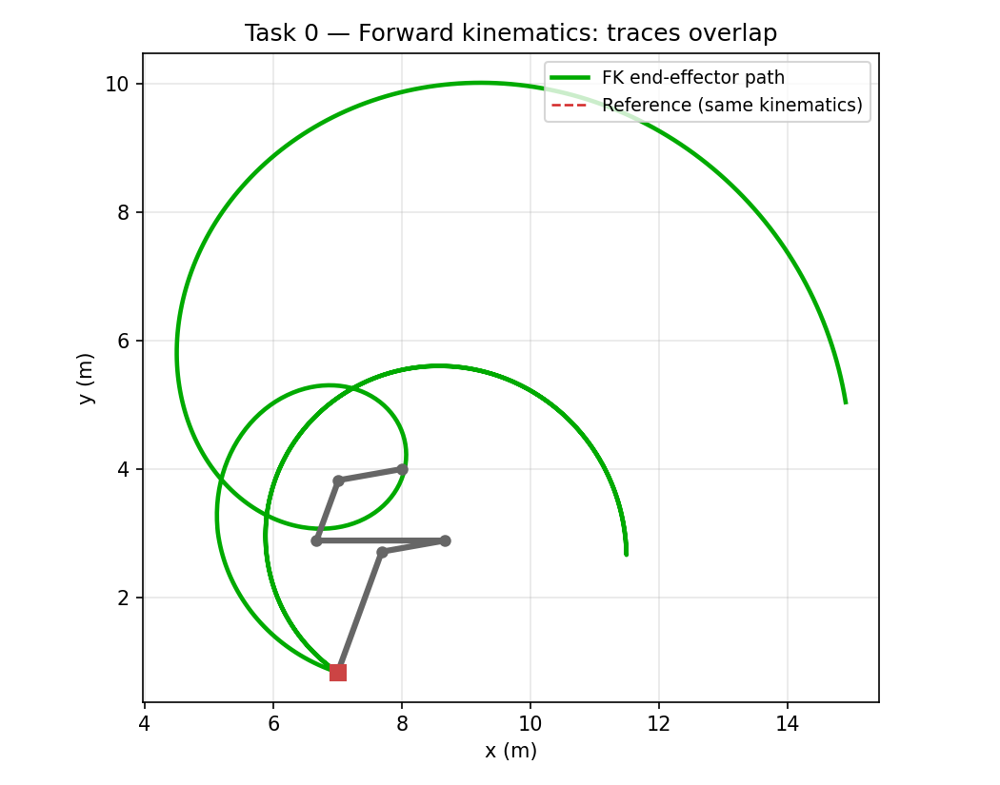
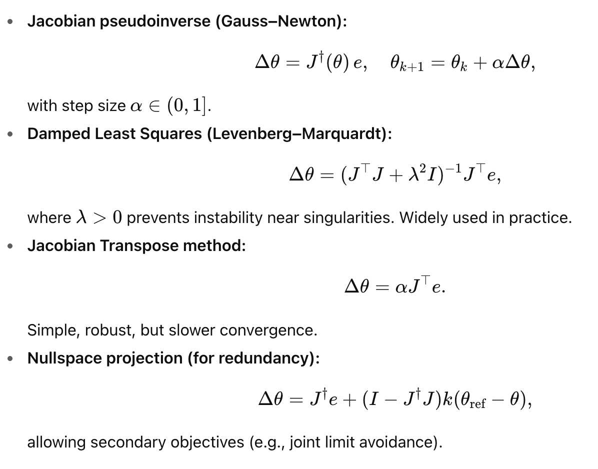
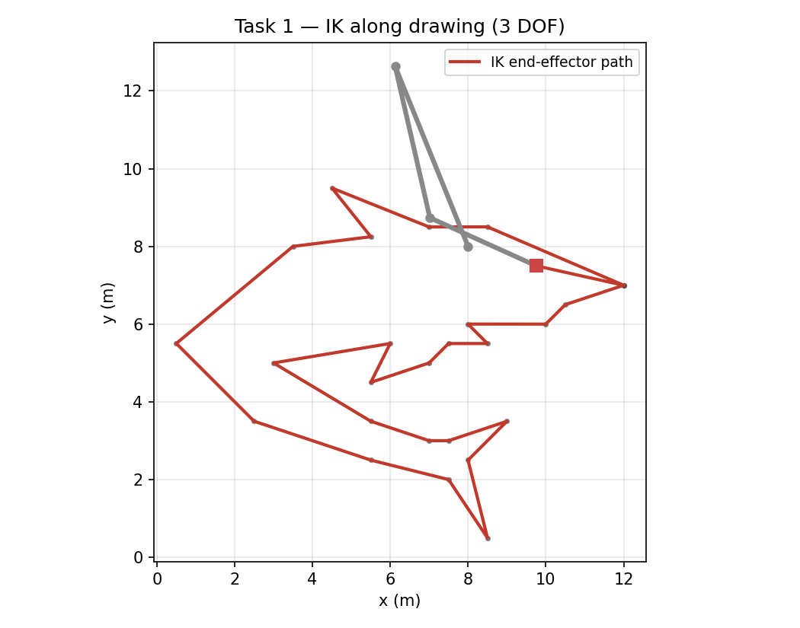
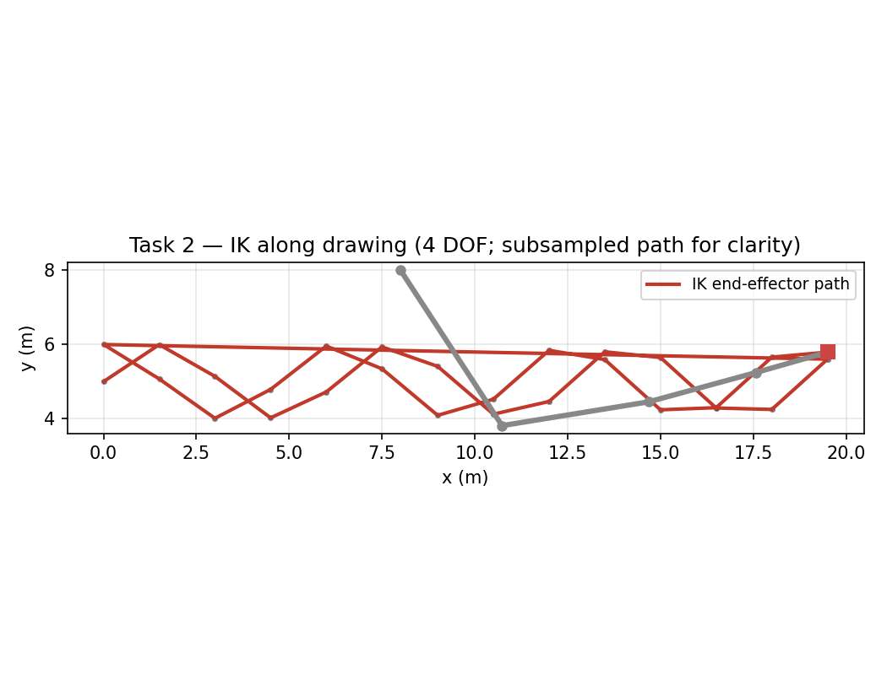
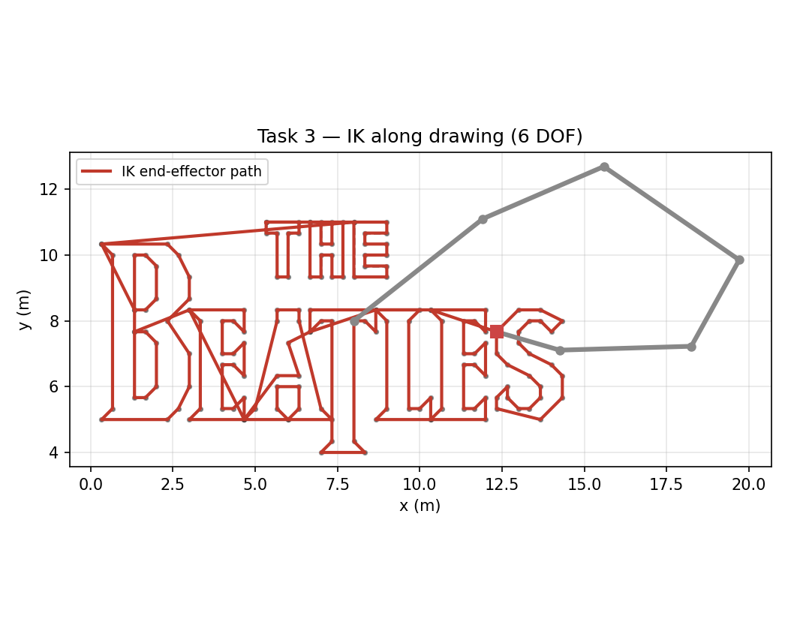
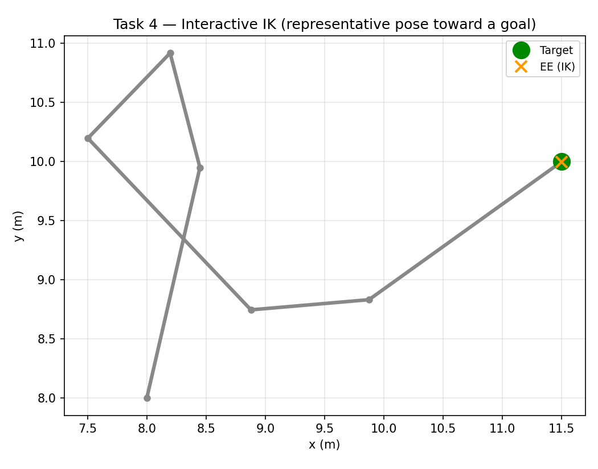

# Звіт до завдання: пряма та зворотна кінематика

**Вихідний код:** [github.com/lensraster/robototechnich-assignment-1-2](https://github.com/lensraster/robototechnich-assignment-1-2) (публічний репозиторій)

У цьому звіті підсумовано реалізацію за вимогами [README_EN.md](README_EN.md): пряма кінематика (Task 0), зворотна кінематика на основі якобіана для плоских маніпуляторів (Tasks 1–3) та інтерактивне демо IK (Task 4).

## Середовище

Дотримуйтесь інструкцій із README:

```bash
python3 -m venv venv
source ./venv/bin/activate
pip install -r requirements.txt
pip install -e .
```

На деяких системах `box2d-py` потребує інструменти збірки (наприклад, SWIG) або попередньо зібраний wheel; якщо встановлення не вдається, додайте відсутні системні пакети.

**Ілюстрації звіту** (нижче) генеруються з тієї самої кінематики, що і в демо (matplotlib, без вікна pygame): `python tools/generate_report_figures.py` (PNG-файли записуються у `figures/`).

## Task 0 — Пряма кінематика

**Мета:** Обчислити положення енд-ефектора за базовою точкою `p0`, довжинами ланок `L_i` та відносними кутами суглобів `q_i`, щоб зелена траєкторія (FK) збігалася з червоною траєкторією (симуляція).

**Модель:** Накопичені кути `φ_i = Σ_{j=0}^{i} q_j`. Кожна ланка додає зміщення `(L_i cos φ_i, L_i sin φ_i)`. Тоді енд-ефектор:

`p_ee = p_0 + Σ_i (L_i cos φ_i, L_i sin φ_i)`.

**Код:** `forward_kinematics` у `robo_algo/kinematics.py` (використовується з `task0.py`).

**Перевірка:** Якщо встановити `TEST_RUN = True` у `task0.py`, скрипт порівнює FK із положенням енд-ефектора з Box2D (`atol=0.1`).



*Task 0 — Траєкторія енд-ефектора з прямої кінематики (зелена) накладена на опорну траєкторію (червона пунктирна); також показано фінальну позу маніпулятора і його кінчик.*

## Tasks 1–3 — Якобіан і зворотна кінематика

**Якобіан:** Для плоского послідовного маніпулятора з обертальними суглобами, використовуючи `φ_i` вище:

- `∂x/∂q_k = Σ_{i≥k} (-L_i sin φ_i)`
- `∂y/∂q_k = Σ_{i≥k} (L_i cos φ_i)`

Отримуємо `J ∈ ℝ^{2×n}` (рядки — похідні за `x` та `y`).

**Метод IK:** Levenberg–Marquardt / damped least squares. На кожній ітерації, для похибки `e = p_goal - p_ee(q)`:

`(J J^T + λ^2 I) v = e`, `Δq = J^T v`

де `λ` — коефіцієнт демпфування (в реалізації це `lm_lambda` у `inverse_kinematics`). Крок масштабується параметром `step_scale` (типово 1). Ітерації зупиняються, коли `‖e‖ < tol` або досягнуто `max_iter`.

Опорна формула (матеріали курсу):



**Nullspace (для надлишкових маніпуляторів, n > 2):** Додатковий член `(I - J^+ J) (q_pref - q)` з `q_pref = 0` зміщує розв’язок у бік нейтральної пози та зменшує дрейф, коли одну й ту саму позу енд-ефектора можна досягти багатьма конфігураціями суглобів. Опція вмикається через `use_nullspace=True` (типово) і застосовується лише для маніпуляторів із більш ніж двома суглобами.

**Логіка малювання:** Для кожного списку поліліній (`get_drawing1()`, `get_drawing2()`, `get_drawing3()`) контролер проходить точки послідовно. Коли `ArmController` у стані очікування (idle), береться наступна цільова точка, `inverse_kinematics` обчислює кути, а `move_to_angles` інтерполює рух із обмеженням `MAX_SPEED`. На кожному кадрі викликаються: `controller.step()`, потім `arm.draw()`.

| Task | Ланки / DOF | Дані |
|------|-------------|------|
| 1 | 3 | `get_drawing1()` — одна замкнена полілінія |
| 2 | 4 | `get_drawing2()` — дві траєкторії синус/косинус |
| 3 | 6 | `get_drawing3()` — кілька окремих фігур |







## Task 4 — Інтерактивна IK

**Поведінка:** Мишею задається цільова точка у світових координатах (зелений маркер). Щоразу, коли контролер у стані idle, цільові кути обчислюються через `inverse_kinematics` для поточної позиції миші, після чого запускається `move_to_angles`; на кожному кадрі виконуються `step()` та `arm.draw()`.

**Що варто спробувати (як у README):** Рухати ціль повільно та швидко, вибирати точки явно поза робочою зоною та порівнювати реакцію маніпулятора при різких змінах цілі (затримка стеження проти плавності). Змінюйте `MAX_SPEED` у `task4.py`, щоб побачити вплив обмеження швидкості інтерполяції.



## Карта файлів

| Файл | Роль |
|------|------|
| `robo_algo/kinematics.py` | FK, якобіан, ітеративна IK (LM + опційний nullspace) |
| `robo_algo/drawing_data.py` | Опис поліліній для Tasks 1–3 (лише numpy) |
| `tools/generate_report_figures.py` | Повторна генерація `figures/*.png` для цього звіту |
| `task0.py` | Візуалізація Task 0 |
| `task1.py` … `task3.py` | Демо IK для малювання |
| `task4.py` | Інтерактивне демо |

## Як запускати

```bash
source ./venv/bin/activate
python task0.py
python task1.py
python task2.py
python task3.py
python task4.py
```

Будь-яке вікно можна закрити клавішею Escape або кнопкою закриття вікна.

## Підсумок

Пряма кінематика реалізована з тією самою угодою про накопичення кутів, що й у `RoboticArm` з `robo_algo/arm.py`. Зворотна кінематика використовує демпфоване оновлення через транспонований якобіан (Levenberg–Marquardt) з опційною проєкцією в nullspace для надлишкових маніпуляторів і інтегрована з наданим `ArmController` для плавного руху вздовж поліліній та до рухомої цілі.
